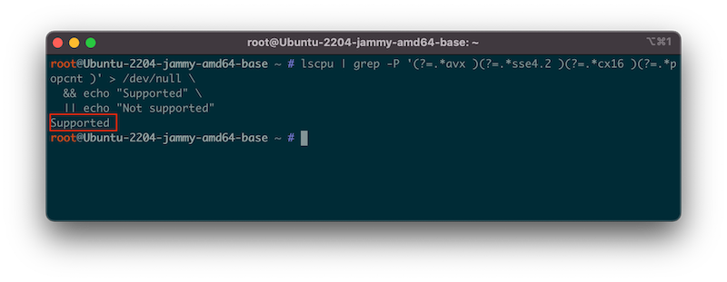
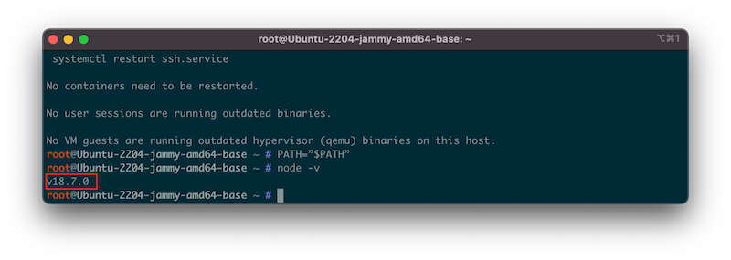
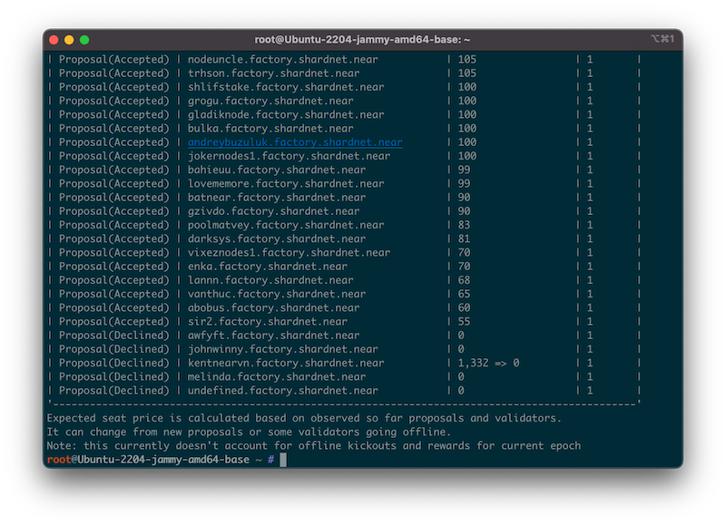
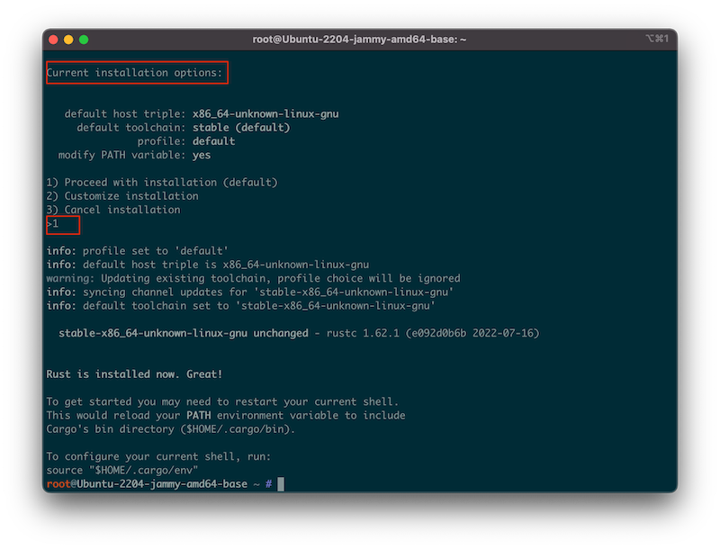
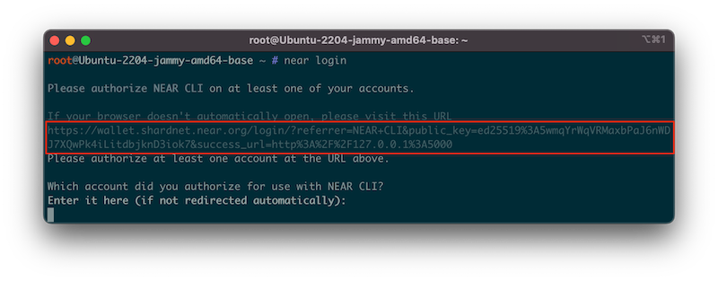
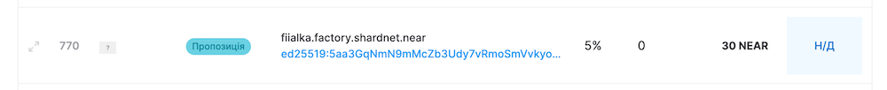

# Покрокова інструкція із налаштування ноди валідатора

### Зміст
* Створення гаманця в Shardnet
* Купівля сервера в Hetzner
* Налаштування сервера та запуск ноди
* Активація ноди як валідатора
* Створення стейкінг пулу
* Налаштування інструментів для моніторингу стану ноди
* Питання та відповіді

## Створення гаманця в Shardnet
Для створення гаманця, необхідно перейти на сайт [https://wallet.shardnet.near.org](https://wallet.shardnet.near.org) та натиснути на **Create Account**.

В наступному вікні придумати собі назву акаунту та натиснути на **Reserve My Account ID**.

Далі вибрати метод для відновлення гаманця, наприклад, **Secure Passphrase**. Система покаже 12 слів, які необхідно скопіювати та зберегти.

На останньому кроці, необхідно буде підтвердити, що фраза скопійована, для цього система попросить вести якесь слово, вказавши її порядковий номер.

Гаманець створений.

## Купівля сервера в Hetzner
Для налаштування валідатора, необхідний сервер з наступною конфігурацією:

| Hardware       | Chunk-Only Producer  Specifications                                   |
| -------------- | ---------------------------------------------------------------       |
| CPU            | 4-Core CPU with AVX support                                           |
| RAM            | 8GB DDR4                                                              |
| Storage        | 500GB SSD                                                             |

В цілях навчання, можна придбати недорогий сервер на хостингу Hetzner, наприклад, [AX41-NVMe](https://www.hetzner.com/dedicated-rootserver/ax41-nvme).
Операційна система - Ubuntu 22.04 LTS.
Після замовлення сервера він буде сконфігурований і на пошту прийде лист з credetials для доступу.

## Налаштування сервера та запуск ноди
Авторизовуємося на сервері, який придбали (де, 10.10.10.10 - це IP-адреса сервера):
```shell
$ ssh root@10.10.10.10
```
> Важливо! Процесор повинен підтримувати Advanced Vector Extensions (AVX). Детально про AVX на [Вікіпедії](https://uk.wikipedia.org/wiki/AVX).
Щоб перевірити підтримку AVX, необхідно виконати наступну команду:
```shell
$ lscpu | grep -P '(?=.*avx )(?=.*sse4.2 )(?=.*cx16 )(?=.*popcnt )' > /dev/null \
  && echo "Supported" || echo "Not supported"
```


##### Оновлення системи
```shell
$ sudo apt update && sudo apt upgrade -y
```

##### Встановлення Node.js
```shell
$ curl -sL https://deb.nodesource.com/setup_18.x | sudo -E bash -
$ sudo apt install build-essential nodejs
$ PATH=”$PATH”
$ node -v
v18.7.0
```


##### Встановлення near-cli
```shell
$ sudo npm install -g near-cli
$ echo 'export NEAR_ENV=shardnet' >> ~/.bashrc
```
Щоб перевірити чи встановлено near-cli та налаштована константа NEAR_ENV, достатньо виконати команду `$ near proposals`, яка виведе на екран список валідаторів ([детальніше про команду](https://docs.near.org/tools/near-cli#near-proposals)).


##### Встановлення необхідних залежностей для валідатора
```shell
$ sudo apt install -y git binutils-dev libcurl4-openssl-dev zlib1g-dev libdw-dev libiberty-dev cmake gcc g++ python3 docker.io protobuf-compiler libssl-dev pkg-config clang llvm cargo
$ sudo apt install python3-pip
$ USER_BASE_BIN=$(python3 -m site — user-base)/bin
$ export PATH=”$USER_BASE_BIN:$PATH”
$ sudo apt install clang build-essential make
```

##### Встановлення Rust та Cargo
```shell
$ curl --proto '=https' --tlsv1.2 -sSf https://sh.rustup.rs | sh
```
При виборі Current installation options вводимо в консоль 1 та натискаємо Enter (Proceed with installation (default))

```shell
$ source $HOME/.cargo/env
```

##### Клонування [репозиторію `nearcore`](https://github.com/near/nearcore) з GitHub

```shell
$ mkdir /home/validator
$ cd /home/validator
$ git clone https://github.com/near/nearcore
$ cd nearcore
$ git fetch
```

Далі необхідно переключитися на необхідний коміт, який можна взяти [тут](https://github.com/near/stakewars-iii/blob/main/commit.md)
```
$ git checkout <commit>
```
Наприклад `$ git checkout c1b047b8187accbf6bd16539feb7bb60185bdc38`

##### У тій же папці білдимо Rust код
```
$ cargo build -p neard --release --features shardnet
```

##### Ініціалізуємо валідатор
```
$ ./target/release/neard --home ~/.near init --chain-id shardnet --download-genesis
```
> Ця команда створить структуру каталогів та згенерує файли `config.json`, `node_key.json` і `genesis.json`. Детальніше можна прочитати [тут](https://github.com/near/stakewars-iii/blob/main/challenges/002.md#initialize-working-directory).

#### Заміна `config.json` на потрібний для Stake Wars
```
$ sudo apt-get install awscli -y
$ rm ~/.near/config.json
$ wget -O ~/.near/config.json https://s3-us-west-1.amazonaws.com/build.nearprotocol.com/nearcore-deploy/shardnet/config.json
```

#### Запуск ноди
```
$ cd /home/validator/nearcore
$ ./target/release/neard --home ~/.near run
```
Ми запустили ноду. Можна побачити результати журналу на консолі. Нода має знайти однорангові вузли, завантажити заголовки до 100%, а потім завантажити блоки. Щоб вийти, необхідно виконати `Ctl + C`.

## Активація ноди як валідатора
#### Локальна авторизація гаманця
```
$ export NEAR_ENV=shardnet
$ near login
```


Далі необхідно скопіювати посилання, вставити в браузер та авторизуватися. Потім повернутися в термінал і ввести адресу гаманця. В моєму випаду, це `fiialka.shardnet.near`

#### Генерація файла з ключем
```
$ near generate-key <pool_id>
```
де <pool_id> - це xx.factory.shardnet.near (xx - ваше ім'я пулу). В моєму випадку, це `fiialka.factory.shardnet.near`. Отже, команда виглядатиме так: `$ near generate-key fiialka.factory.shardnet.near`

Далі згенерований ключ необхідно скопіювати в папку валідатора
```
$ cp ~/.near-credentials/shardnet/fiialka.factory.shardnet.near.json ~/.near/validator_key.json
```
Потім необхідно відкрити файл та замінити `xx.factory.shardnet.near` на ваш <pool_id>, а ключ `private_key` на `secret_key`.
```json
{
  "account_id": "fiialka.factory.shardnet.near",
  "public_key": "ed25519:5aa3GqNmN9mMcZb3Udy7vRmoSmVvkyoMWrJSPyL1BV33",
  "secret_key": "ed25519:****"
}
```
> Щоб красиво відкривати для перегляду json файли, необхідно встановити `$ sudo apt install jq`.
> Команда для перегляду, наприклад, `validator_key.json` буде наступною `$ cat ~/.near/validator_key.json | jq`

#### Запуск ноди валідатора
```
$ cd /home/validator/nearcore
$ ./target/release/neard --home ~/.near run
```

#### Створення сервісу (для роботи валідатора у фоні)
```
$ sudo nano /etc/systemd/system/neard.service
```
Вміст файлу
```
[Unit]
Description=NEARd Daemon Service
[Service]
Type=simple
User=root
#Group=near
WorkingDirectory=/root/.near
ExecStart=/home/validator/nearcore/target/release/neard run
Restart=on-failure
RestartSec=30
KillSignal=SIGINT
TimeoutStopSec=45
KillMode=mixed
[Install]
WantedBy=multi-user.target
```

Для активації сервісу, необхідно виконати: `$ sudo systemctl enable neard`. Тепер можна використовувати наступні команди для запуску, зупинти та перевантаження відповідно:
```
$ sudo systemctl start neard
$ sudo systemctl stop neard
$ sudo systemctl restart neard
```

#### Для красивового виведення логів в термінал
```
$ sudo apt install ccze
$ journalctl -n 100 -f -u neard | ccze -A
```

## Створення стейкінг пулу
#### Команда для створення стейкінг пулу
```
$ near call factory.shardnet.near create_staking_pool '{"staking_pool_id": "<pool id>", "owner_id": "<accountId>", "stake_public_key": "<public key>", "reward_fee_fraction": {"numerator": 5, "denominator": 100}, "code_hash":"DD428g9eqLL8fWUxv8QSpVFzyHi1Qd16P8ephYCTmMSZ"}' --accountId="<accountId>" --amount=30 --gas=300000000000000
```
* `<pool id>` - пул айді (в моєму випадку - `fiialka`)
* `<accountId>` - ім’я гаманця, який створений на https://wallet.shardnet.near.org (в моєму випадку - `fiialka.shardnet.near`)
* `<public key>` - публічний ключ з файлу `validator_key.json` (команда для відкриття файлу `$ cat ~/.near/validator_key.json | jq`)
* `reward_fee_fraction` - комісія, яку стягуватиме пул (наприклад, у цьому випадку 5 на 100 становить 5% комісії)

Приклад команди для мене:
```
$ near call factory.shardnet.near create_staking_pool '{"staking_pool_id": "fiialka", "owner_id": "fiialka.shardnet.near", "stake_public_key": "ed25519:5aa3GqNmN9mMcZb3Udy7vRmoSmVvkyoMWrJSPyL1BV33", "reward_fee_fraction": {"numerator": 5, "denominator": 100}, "code_hash":"DD428g9eqLL8fWUxv8QSpVFzyHi1Qd16P8ephYCTmMSZ"}' --accountId="fiialka.shardnet.near" --amount=30 --gas=300000000000000
```
Якщо результат виконання команди *Success*, то на [explorer](https://explorer.shardnet.near.org/nodes/validators) можна побачити свій валідатор.
На провіднику статус поряд із валідатором буде **Пропозиція**

Тепер, щоб валідатор став активним, та почав отримувати комісію необхідно делегувати йому трохи Near. Ціна валідатора динамічна і її можна подивитися у провіднику (Seat Price). Станом на 31.07.2022 - 165 NEAR.

#### Делегування потрібної кількості Near на наш валідатор
```
$ near call <staking_pool_id> deposit_and_stake --amount <amount> --accountId <accountId> --gas=300000000000000
```
* `<staking_pool_id>` - ім’я стейкінг пулу (в моєму випадку - `fiialka.factory.shardnet.near`)
* `<amount>` - сума
* `<accountId>` - ім’я акаунту з якого будемо знімати гроши на стейкінг (в моєму випадку - `fiialka.shardnet.near`)

Приклад команди для мене:
```
$ near call fiialka.factory.shardnet.near deposit_and_stake --amount 165 --accountId fiialka.shardnet.near --gas=300000000000000
```
Після цієї команди стан валідатора зміниться на **Приєднання**. Після цього потрібно зачекати одну епоху, щоб почати отримувати комісію та стейкінг пул додали до переліку валідаторів.

## Інструменти для моніторингу стану ноди
#### Версія ноди
```
$ curl -s http://127.0.0.1:3030/status | jq .version
```
```json
{
  "version": "trunk",
  "build": "crates-0.14.0-275-gc1b047b81",
  "rustc_version": "1.62.1"
}
```
### Делегатори
```
$ near view fiialka.factory.shardnet.near get_accounts '{"from_index": 0, "limit": 10}' --accountId fiialka.shardnet.near
```

## Питання та відповіді

### Якщо стався hardfork
Необхідно видалити файл `genesis.json`, папку `data` та перезапустити сервіс:
```
$ cd /root/.near
$ rm genesis.json
$ wget https://s3-us-west-1.amazonaws.com/build.nearprotocol.com/nearcore-deploy/shardnet/genesis.json
$ rm -rf data
$ sudo systemctl restart neard
```

### Якщо оновився файл конфігурації
```
$ rm ~/.near/config.json
$ wget -O ~/.near/config.json https://s3-us-west-1.amazonaws.com/build.nearprotocol.com/nearcore-deploy/shardnet/config.json
$ sudo systemctl restart neard
```

### Якщо оновився [комміт](https://github.com/near/stakewars-iii/blob/main/commit.md)
```
$ cd /home/validator/nearcore
$ git fetch
$ git checkout c1b047b8187accbf6bd16539feb7bb60185bdc38
$ cargo build -p neard --release --features shardnet
$ sudo systemctl restart neard
```